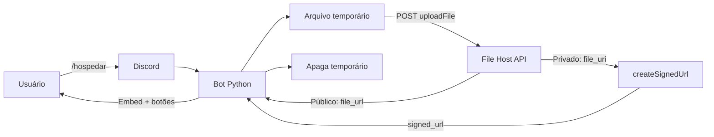

<div align="center">


# 𝑲𝒏𝒐𝒙 𝑭𝒊𝒍𝒆 𝑯𝒐𝒔𝒕

**Hospede arquivos pelo Discord e receba links permanentes ou temporários.**

[](https://python.org)
[](https://discord.com)
[](https://file-host.base44.app/docs)
[](./LICENSE)

**Criado e mantido por [Knox Dev](https://github.com/knox-devx)**

</div>

---

## ✨ Visão geral

Este bot usa a **File Host API v1** para receber anexos do Discord e transformá-los em links. A API é pública, não exige login e documenta suporte a arquivos públicos, privados, senha e links temporários.

> [!IMPORTANT]
> A API informa não possuir limite de tamanho ou uso. Porém, quando o arquivo entra pelo Discord, o anexo continua sujeito ao limite de upload imposto pelo próprio Discord.

## 🚀 Recursos

- 📦 `/hospedar` com qualquer tipo de anexo aceito pelo Discord
- 🌐 Arquivos públicos com link permanente
- 🔒 Arquivos privados
- ⏳ Link assinado temporário para arquivo privado
- 🔑 Senha opcional de proteção
- 👁️ Botão de preview quando `view_url` estiver disponível
- 🙈 Resposta opcional visível apenas para quem executou o comando
- 💾 Arquivos temporários locais apagados após o processamento
- 🧵 Upload assíncrono
- 🇧🇷 Código e comentários em português
- 🧪 Testes automatizados
- ✅ GitHub Actions

---

## 🔌 API utilizada

**URL base das funções:**

```text
https://file-host.base44.app/functions/
```

**Documentação:**

```text
https://file-host.base44.app/docs
```

### `POST /uploadFile`

Endpoint usado pelo bot:

```text
https://file-host.base44.app/functions/uploadFile
```

O bot envia `multipart/form-data` com:

| Campo | Tipo | Uso |
|---|---|---|
| `file` | arquivo | obrigatório |
| `private` | `true` / `false` | define armazenamento privado |
| `password` | texto | proteção opcional |

Resposta esperada:

```json
{
  "id": "abc123",
  "name": "file.png",
  "file_url": "https://...",
  "file_uri": "",
  "is_private": false,
  "mime_type": "image/png",
  "size": 102400,
  "created_date": "2026-08-26T21:33:00Z",
  "view_url": "/file/abc123"
}
```

### `POST /createSignedUrl`

Endpoint usado automaticamente para arquivos privados:

```text
https://file-host.base44.app/functions/createSignedUrl
```

JSON enviado:

```json
{
  "file_uri": "FILE_URI",
  "expires_in": 3600
}
```

A API aceita expiração de **60 segundos até 2.592.000 segundos (30 dias)**.

---

## 🎮 Comandos

### `/hospedar`

| Opção | Obrigatória | Padrão | Descrição |
|---|:---:|---|---|
| `arquivo` | ✅ | — | anexo que será hospedado |
| `privado` | ❌ | `false` | salva o arquivo como privado na API |
| `senha` | ❌ | — | senha de proteção |
| `expira_em` | ❌ | `3600` | duração do link privado em segundos |
| `somente_eu` | ❌ | `false` | torna a resposta do Discord privada |

Exemplo público:

```text
/hospedar arquivo:projeto.zip privado:false
```

Exemplo privado por 24 horas:

```text
/hospedar arquivo:backup.zip privado:true expira_em:86400 somente_eu:true
```

Exemplo protegido por senha:

```text
/hospedar arquivo:arquivo.pdf senha:minha-senha
```

### `/sobre`

Mostra informações da API, endpoints e créditos do projeto.

---

## ⚙️ Configuração

Copie `.env.example` para `.env`:

```env
DISCORD_TOKEN=TOKEN_DO_SEU_BOT
BOT_NAME=Knox File Host
SYNC_COMMANDS=true

API_FUNCTIONS_URL=https://file-host.base44.app/functions
API_UPLOAD_URL=https://file-host.base44.app/functions/uploadFile
API_SIGNED_URL=https://file-host.base44.app/functions/createSignedUrl

API_CONNECT_TIMEOUT=30
API_READ_TIMEOUT=1800
```

A API é pública, portanto **não é necessária API key**.

---

## 📥 Instalação

```bash
git clone https://github.com/knox-devx/bot-discord-file-host-.git
cd bot-discord-file-host-
python -m venv .venv
```

### Linux/macOS

```bash
source .venv/bin/activate
pip install -r requirements.txt
cp .env.example .env
python main.py
```

### Windows

```powershell
.venv\Scripts\activate
pip install -r requirements.txt
copy .env.example .env
python main.py
```

---

## 🧠 Fluxo



---

## 🔐 Segurança

- Nunca envie seu `.env` para o GitHub.
- O bot não executa o arquivo enviado.
- A senha opcional é encaminhada diretamente no multipart e não é exibida na resposta.
- Arquivos temporários são apagados mesmo quando a API retorna erro.
- Para conteúdo sensível, use `privado:true` e `somente_eu:true`.

> [!NOTE]
> Quem opera o bot deve seguir os Termos do Discord, os termos da File Host API e as leis aplicáveis ao conteúdo hospedado.

---

<div align="center">

### ✦ Knox Dev ✦

**Python • Discord • File Hosting**


</div>
