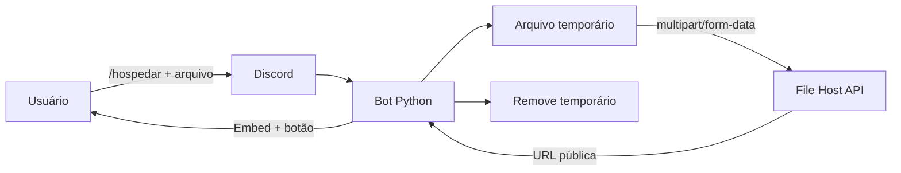

<div align="center">


# 𝑲𝒏𝒐𝒙 𝑭𝒊𝒍𝒆 𝑯𝒐𝒔𝒕

**Envie um arquivo pelo Discord. Receba um link público.**

[](https://python.org)
[](https://discord.com)
[](https://file-host.base44.app/docs)
[](./LICENSE)

**Criado e mantido por [Knox Dev](https://github.com/knox-devx)**

</div>

---

## ✨ O que ele faz?

O bot recebe um `discord.Attachment` através do comando `/hospedar`, baixa o arquivo temporariamente, envia para a **File Host API** e devolve o endereço público retornado pela API.

Ele **não define um limite próprio de tamanho ou quantidade de arquivos**. Na prática continuam existindo os limites externos do Discord, do servidor em que o bot roda e da própria API de hospedagem.

> [!NOTE]
> Site/documentação atual da API: **https://file-host.base44.app/docs**

## 🚀 Recursos

- 📦 `/hospedar arquivo:<anexo>`
- 🔗 Botão direto para abrir o arquivo hospedado
- 👁️ Resposta pública ou privada
- ♾️ Sem limite artificial de quantidade/tamanho no código do bot
- 🧠 Descoberta automática de rotas comuns de Backend Functions do Base44
- ⚙️ Endpoint exato configurável por `.env`
- 🔑 Suporte opcional a API key
- 💾 Arquivo temporário removido automaticamente após o envio
- 🧵 Uploads assíncronos sem travar o bot
- 🧪 Testes para interpretar diferentes formatos de resposta da API
- ✅ GitHub Actions para validar o projeto
- 🇧🇷 Código e comentários em português

---

## ⚙️ Configuração

Copie `.env.example` para `.env`:

```env
DISCORD_TOKEN=TOKEN_DO_SEU_BOT
BOT_NAME=Knox File Host

API_BASE_URL=https://file-host.base44.app
API_UPLOAD_URL=
API_FUNCTIONS=upload,upload-file,host-file

API_KEY=
API_KEY_HEADER=Authorization
API_KEY_PREFIX=Bearer
```

### Qual URL da API é usada?

O domínio atual do serviço é:

```text
https://file-host.base44.app
```

A documentação atual está em:

```text
https://file-host.base44.app/docs
```

Quando `API_UPLOAD_URL` estiver vazio, o cliente tenta as funções configuradas em `API_FUNCTIONS` usando o formato padrão de Backend Functions:

```text
https://file-host.base44.app/functions/upload
https://file-host.base44.app/functions/upload-file
https://file-host.base44.app/functions/host-file
```

Também existe um fallback para o formato legado `/base44/functions/...`, evitando quebra caso o backend ainda exponha alguma função antiga por esse caminho.

Se a documentação informar uma rota exata, configure a URL completa:

```env
API_UPLOAD_URL=https://file-host.base44.app/functions/NOME_EXATO_DA_FUNCAO
```

Quando `API_UPLOAD_URL` está preenchido, o bot usa **somente essa rota** e não tenta alternativas.

### Formato do upload

O cliente envia o arquivo como:

```text
Content-Type: multipart/form-data
campo: file
```

O cliente reconhece respostas contendo campos como:

```json
{
  "file_url": "https://..."
}
```

Também aceita `url`, `link`, `download_url`, `public_url`, `fileUrl` e respostas aninhadas em `data`, `result`, `file` ou `upload`.

---

## 📥 Instalação

```bash
git clone https://github.com/knox-devx/bot-discord-file-host-.git
cd bot-discord-file-host-
python -m venv .venv
```

### Linux

```bash
source .venv/bin/activate
pip install -r requirements.txt
cp .env.example .env
python main.py
```

### Windows

```powershell
.venv\Scripts\activate
pip install -r requirements.txt
copy .env.example .env
python main.py
```

---

## 🎮 Comandos

| Comando | Descrição |
|---|---|
| `/hospedar` | Envia um arquivo para a API e devolve o link |
| `/sobre` | Exibe informações sobre o serviço e a documentação atual |

### Exemplo

```text
/hospedar arquivo:meu-projeto.zip privado:false
```

O retorno inclui nome, tamanho, tipo MIME, link e um botão **Abrir arquivo**.

---

## 🗂️ Estrutura

```text
bot-discord-file-host-/
├── .github/
│   └── workflows/
│       └── ci.yml
├── bot/
│   ├── cogs/
│   │   └── files.py
│   ├── api_client.py
│   └── config.py
├── tests/
│   └── test_api_client.py
├── .env.example
├── .gitignore
├── LICENSE
├── README.md
├── main.py
└── requirements.txt
```

## 🧠 Fluxo



---

## 🔐 Segurança

- Nunca envie seu `.env` para o GitHub.
- O token do Discord e uma possível API key ficam fora do repositório.
- O bot não executa nem abre o conteúdo dos arquivos enviados.
- O nome original é enviado como metadado do multipart; o caminho temporário local é gerado pelo sistema.
- Arquivos temporários são apagados após sucesso ou erro.

> [!IMPORTANT]
> Quem hospeda o bot é responsável por cumprir os Termos do Discord, os termos da API utilizada e as leis aplicáveis ao conteúdo armazenado.

---

<div align="center">

### ✦ Knox Dev ✦

**Python • Discord • File Hosting**


</div>
